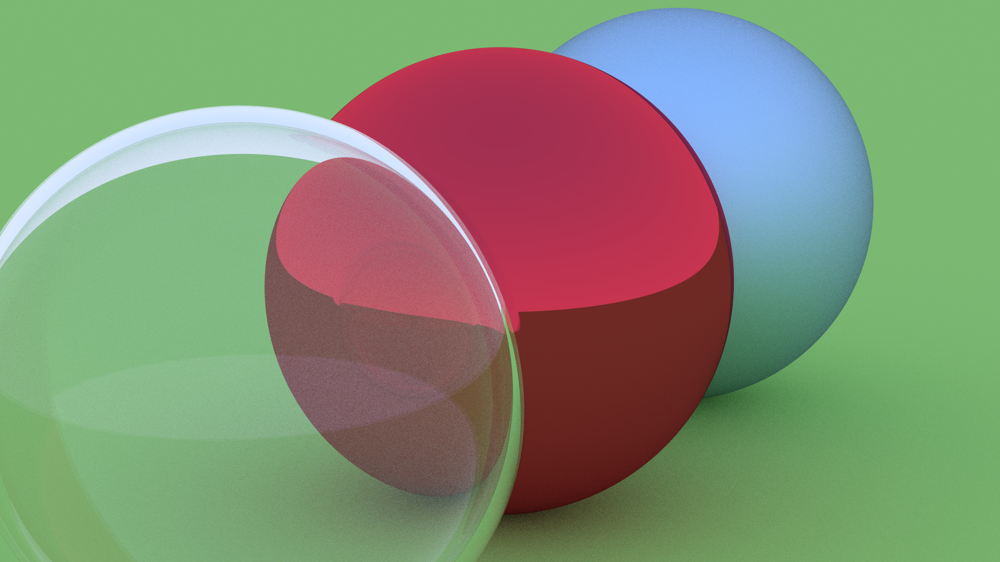

Raydiator
==========

Ein Raytracer in Rust
---------------------

### Ziele

#### Verbindlich

- Erstellen von Bildern durch Raytracing
- Mehrere darstellbare Objekte
- Verschiedene Materialien
- Transparente Materialien
- Multithreading

#### Optional

- Verschiedene Ausgabeformate
- Lesen der Welt aus Dateien
- Lichtquellen
- Verschiedene Objekttypen (Dreiecke)